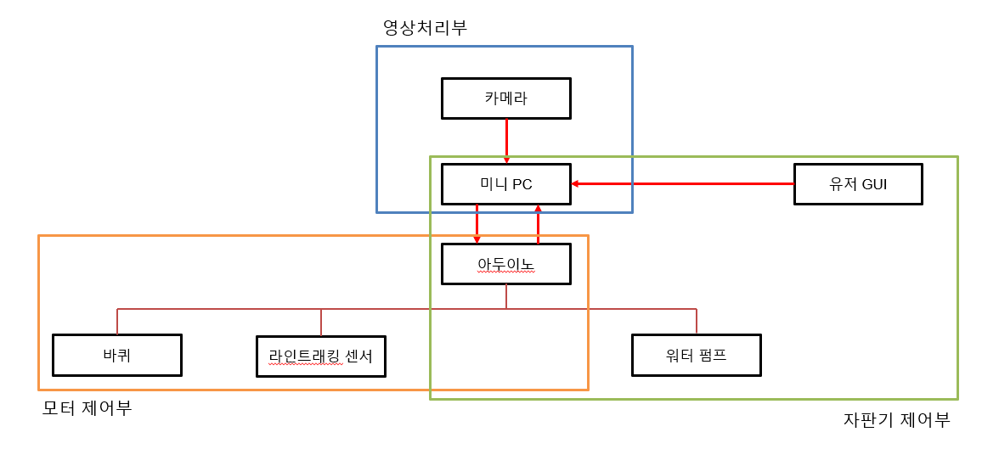
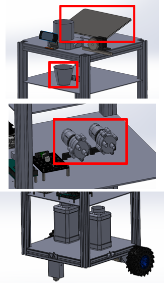
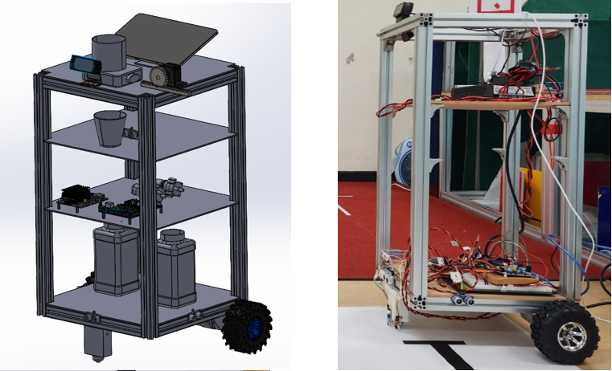
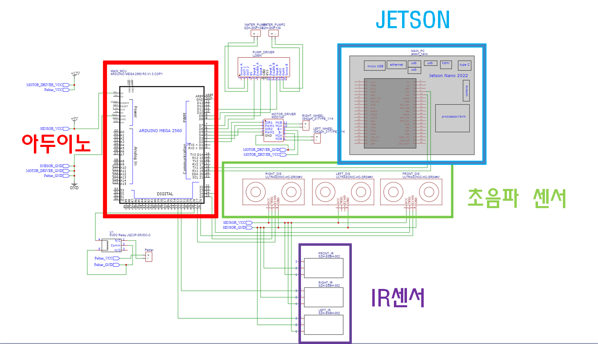
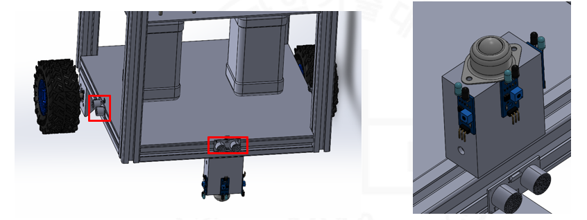
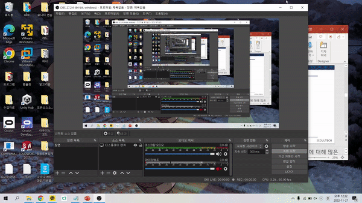
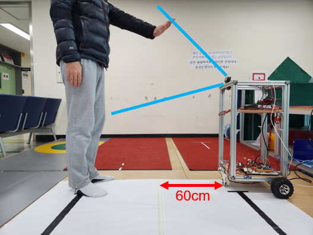
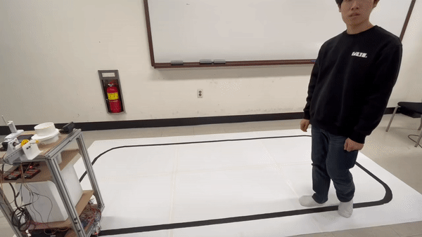

# CoffeeRobot :coffee:
자동화시스템 프로젝트 팀플 리포지토리

**[김성욱](https://github.com/AsdoubleU), [안진우](https://github.com/want2bedoctor), [양유경](https://github.com/callme60), [조수민](https://github.com/1213tnals)** 이 함께 진행한 자동커피로봇 프로젝트입니다.   
   
이 프로젝트를 통해, ***정해진 라인을 따라 이동을 기본으로 하며 주변의 장애물을 회피 및 사용자를 판단하여 사용자의 주문을 받고 그 주문에 맞는 커피를 제작하는 로봇*** 을 만들고자 하였습니다.   
&nbsp;&nbsp;&nbsp;&nbsp;   
_______________________________________________   
## 1. Design(하드웨어 설계 및 초기 구성)   
   
로봇의 전체적인 작동을 위해 전체적인 통신 구축을 다음과 같이 구상을 하였습니다.   
우선 로봇이 움직이는 것을 처리하는 **모터제어부**, 사람을 인식하는 **영상처리부**, 입력받은 주문을 처리하는 **자판기 제어부**로 구성이 됩니다.    
- 모터제어부에서는 **라인트래킹 센서(IR)과 초음파 센서를 통해서 라인을 따라가는 것을 기본으로 하고 장애물이 인지될 경우 다시 라인을 만날 때까지 PID 기반의 장애물 회피 이동(장애물과의 거리를 유지하여 이동)** 을 하도록 하였습니다.    
- 영상처리부에서는 이동을 하다가 **yolov5 를 기반으로 사람의 손바닥 이미지(정지신호를 의미)를 학습한 후 사람의 손을 인식하면 멈추도록** 하였습니다.   
- 자판기 제어부의 경우 **유니티 앱을 통해 로봇의 작동을 처리하는 키오스크를 구성**하여 입력받은 주문을 통해서 사람이 입력한 주문을 로봇에 넘겨주어 주문에 대한 커피를 만들어주도록 하였습니다.   
   
   
&nbsp;&nbsp;   
   
이렇게 구축한 로봇은 다음과 같이 상부와 중간, 하부가 구성되었습니다.   
- 상부에는 주문을 입력받고 컵을 떨어뜨려주는 부분이 있습니다.   
- 중간에는 커피에 들어가는 원액과 물의 비율을 조절하여 분사하는 워터펌프와 제어보드들이 있습니다.   
- 하부에서는 이동을 위한 바퀴 및 IR, 초음파 센서들이 있습니다.   
   
&nbsp;&nbsp;   
   
   
&nbsp;&nbsp;&nbsp;&nbsp;   
_______________________________________________   
## 2. 제어 및 센서, 이미지처리 구축   
   
제어를 위한 회로는 위와 같이 구성하였습니다. 사용한 보드는 **아두이노 메가**와 **젯슨 나노**이며, 두 보드는 시리얼을 통해 통신이 됩니다.   
또한 키오스크의 역할을 하는 앱은 핸드폰을 통해서 작동을 하며, 핸드폰에서 처리된 입력을 기반으로 생성된 명령값은 **ros**를 통해서 같은 ip 내에 있는 젯슨을 통해서 넘어가며, 로봇의 상태는 반대로 핸드폰으로 입력됩니다.   
   
&nbsp;&nbsp;   
   
바퀴는 다음과 같이 _2개의 모터를 통해서 구동되며 전방에 볼 캐스터를 장착하는 방식_ 으로 만들었습니다.   
이때 사용한 모터는 ***정격토크를 확인하고 로봇의 하중 12kg을 버티는 것을 확인 후 장착*** 하였으며 pwm을 통해서 제어 가 되도록 하였습니다.   
모터의 브라켓을 설계 및 3D 프린터로 출력하여 프레임에 장착하였고, 처음에는 L298 모터 드라이버를 사용하였으나 발열과 해당 모터드라이버가 2A까지가 적정인 것을 확인하여 바퀴의 구동에 필요한 최소 5A를 확보하기 위해 **MDD10A 모터드라이버로 변경**을 하였습니다.   
   
&nbsp;&nbsp;   
   
로봇이 라인을 따라 이동 및 장애물 회피를 위한 센서들을 로봇의 하부에 다음과 같이 장착을 하였습니다.   
전방 하부에 **볼 캐스터를 장착한 기둥 부의 앞에 IR 센서 3개를 장착**하였고 **로봇의 하부 프레임 전방,좌,우에 초음파 센서를 장착**하였습니다.   
   
&nbsp;&nbsp;   
   
로봇이 라인트래킹을 하기 위한 IR 센서의 작동을 테스트 하였습니다.   
   
&nbsp;&nbsp;   
   
이용하려는 사용자를 인식하기 위해서 초음파 및 IR과 같은 센서만을 사용하기에는 문제가 있었습니다. 사용자임을 조금 더 명확히 인지할 수 있도록 하기 위해서 영상처리를 사용하였으며 이를 위해서 **yolov5를 사용**하였고, 이를 위해 이미지처리 보드로 젯슨 나노를 사용하였습니다. yolov5를 사용하려면 python3.7이 지원되어야 했기 때문에 ***python3.7 이상을 지원하는 ubuntu20.04 기반의 젯슨 os를 사용*** 하였습니다.   
   
&nbsp;&nbsp;   
   
이용할 사용자임을 인지하도록 할 사람의 손을 학습시키고 로봇의 상부에 위치한 카메라를 통해서 **80% 이상일 때만 사람의 손임을 인지하고 정지 신호를 아두이노로 전송**할 수 있도록 하였습니다.   
   
&nbsp;&nbsp;   
   
사용자의 손을 인지하고 나서는 주문을 입력받고 커피를 추출해야 합니다. 커피 자판기처럼 커피를 담을 종이컵을 떨어뜨리기 위한 매커니즘을 다음과 같이 구성하였고, **상부에 위치한 스텝모터를 통해서 커피컵을 떨어뜨릴 수 있도록** 하였습니다.   
   
&nbsp;&nbsp;&nbsp;&nbsp;   
_______________________________________________   
## 3. 통신 구축   
사용자가 입력한 주문을 기반으로 입력을 받고 자동으로 커피를 만들기 위한 키오스트 역할을 하는 앱이 필요하였습니다.   
앱은 **Unity**를 통해서 구현하였으며, Unity 앱을 통해서 사용자가 입력한 데이터는 ROS의 tcp 통신 패키지를 사용하여 유니티의 입력을 젯슨 나노로 입력할 수 있도록 하였습니다.   
젯슨은 ***로봇의 전체 작동의 중심 보드로 사용*** 하였기 때문에 로봇의 상태에 대한 정보를 가지고 있으며 아두이노로부터의 명령 또한 Unity로 전송하는 역할도 합니다.   
   
&nbsp;&nbsp;   
   
   
사용자는 앱을 통해서 메뉴를 선택할 수 있습니다. 선택한 메뉴를 기반으로 로봇은 자판기 제어부 처리를 진행하며, 자판기 제어부에서 커피를 제작 완료하면 키오스크를 통해 커피를 가져가라는 화면을 띄웁니다.   
상부에 위치한 초음파 센서를 통해 사용자가 커피를 가져갔음을 인식하면 다시 유니티 앱은 초기화면으로 돌아갑니다.   
   
&nbsp;&nbsp;&nbsp;&nbsp;   
_______________________________________________   
## 4. 실제 로봇 적용   
   
   
로봇은 바닥의 라인을 따라 주행을 합니다. 이때 로봇의 하부에 있는 IR 센서를 통해 로봇 양쪽의 바퀴 속도를 결정합니다.   
경로를 완전히 벗어나거나 곡선과 같은 구간에서 센서가 인식하지 못하는 구간에 진입하게 될 경우 로봇의 IR센서가 마지막에 인식했던 신호를 기반으로 현재 라인을 벗어나 왼쪽으로 이동중인지 오른쪽으로 이동중인지를 판단하여 다시 라인을 추적할 수 있도록 하였습니다.   
   
***이동중에 전방에 장애물이 인지될 경우 우선 정지를 합니다. 이후 로봇의 좌우에 장애물 정보를 확인하고 장애물이 더 가까이 있다고 인지한 방향의 반대로 회전을 합니다. 회전한 이후, 회전 이전에 전방에 해당하는 방향에 있던 장애물과의 거리를 일정한 거리로 유지하면서(이 로봇에서는 30cm를 유지하도록 함) PID 제어를 통해서 그 거리를 계속해서 유지하며 이동*** 하도록 하였습니다. 그러다가 ***다시 IR 센서를 통해서 라인을 만날 경우 다시 라인을 따라 이동*** 하도록 하였습니다. 라인을 만났을 때 현재의 이동에 대해서 시계방향으로 이동하며 라인을 따라가도록 하였습니다.   
   
&nbsp;&nbsp;   
   
   
<!--    -->
로봇은 라인을 따라 이동하고 장애물을 회피하며 주행을 하다가 사람을 인식하면(사람의 정지명령을 인식하면) 주행을 정지하고 사람의 주문을 입력받아야 합니다.   
이때 사람이 주문을 하려다 마는 경우, 혹은 지나가는 행인의 손동작으로 인해 오인식할 수 있음을 생각하여 정지 이후 ***10초간 주문명령이 들어오지 않을 경우 다시 주행*** 하도록 하였습니다.   
사람이 주문에 대한 버튼을 입력하게 되면 로봇은 완전히 주문 대기 모드로 전환합니다.   
이때 사람이 입력한 주문에 대한 커피를 제작하기 위해 커피 컵 모터 작동, 모터 펌프 작동이 진행된 후 사용가 컵을 가져가는 것을 대기합니다.   
사용자가 컵을 가져감을 인식하면 로봇은 ***10초간 대기 한 뒤 앱을 초기화면으로 되돌리고 다시 라인래킹, 장애물 회피 주행을 재개*** 합니다.   
이때 키오스크로서 작동하는 앱의 화면은 로봇의 상태(커피 제작중, 커피 가져가기 알림)를 계속해서 알려주도록 합니다.   